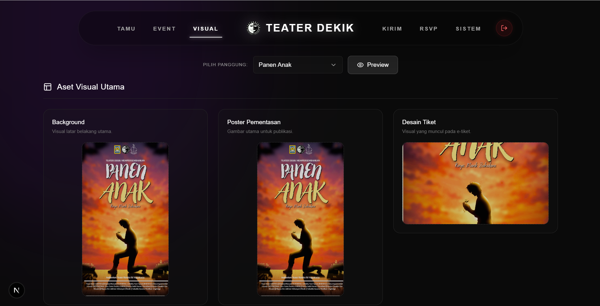

# 🎭 Undangan Digital Teater Dekik

Aplikasi web modern (berbasis Next.js) untuk manajemen, kustomisasi visual, dan penyebaran undangan digital khusus pementasan teater. Sistem ini mengombinasikan tampilan undangan (klien) yang interaktif nan premium dengan dasbor administrasi (admin) yang sangat komprehensif. Terintegrasi penuh dengan **Supabase** untuk basis data (PostgreSQL) dan penyimpanan aset (Storage).

 *(Opsional: Tambahkan screenshot aplikasi Anda di dalam folder public dengan nama preview.png)*

## ✨ Fitur Utama

### Sisi Pengguna (Tamu Undangan)
- **Animasi Interaktif:** Tampilan awal buka amplop otomatis yang elegan (dibangun menggunakan Framer Motion).
- **Audio Autoplay & Toggle:** Fitur pemutar lagu pengiring yang dapat dihidupkan/dimatikan kapan saja.
- **Daftar Pementasan Dinamis:** Tampilan slide/korsel (carousel) untuk daftar pertunjukan.
- **Sponsor interaktif:** Logo-logo sponsor dapat digeser (swipe) jika lebih dari batas layar.
- **e-Tiket & QR Code:** Tamu yang melakukan RSVP akan mendapatkan QR code secara otomatis.
- **Integrasi Maps:** Peta lokasi disematkan langsung (Google Maps Embed).

### Sisi Admin (Dasbor)
- **Manajemen Pementasan (Events):** Atur judul, waktu, lokasi peta, hingga kolom khusus nama Penulis/Sutradara/Kreator pementasan.
- **Manajemen Tamu (Guests):** Tambah, edit, dan hapus data tamu (kategori: Alumni & Teater). Fitur "Cari" yang responsif.
- **Distribusi (Broadcast):** Buat tautan (*link*) khusus untuk tiap tamu dan langsung bagikan melalui pesan auto-generate ke **WhatsApp**. 
- **Kustomisasi Visual & Aset:** 
  - Unggah aset visual untuk setiap pementasan: Poster, *Background*, *Tiket*, Logo-logo *Header*, dan Logo Sponsor.
  - Tambahkan/edit nama sponsor yang langsung terhubung dengan logonya.
  - Atur file audio (lagu pengiring) `mp3/wav` secara spesifik.
- **Manajemen Kehadiran (RSVP):** Pantau status konfirmasi tamu (Hadir, Tidak Hadir, Belum Merespon) secara instan.
- **Mobile First & UX Friendly:** Dasbor sangat adaptif saat dibuka dari perangkat seluler. Kotak opsi (Custom Select) serta tata letak tabel telah disesuaikan agar tidak tumpang tindih (*overlap*).

## 🚀 Teknologi yang Digunakan
- **Frontend:** [Next.js 15](https://nextjs.org/) (App Router), React, TypeScript.
- **Styling:** [Tailwind CSS](https://tailwindcss.com/) dengan dukungan visual yang modern (glassmorphism, transisi mulus).
- **Animasi:** [Framer Motion](https://www.framer.com/motion/).
- **Ikon:** [Lucide React](https://lucide.dev/).
- **Backend/BaaS:** [Supabase](https://supabase.com/) (PostgreSQL & Storage).

---

## 🛠️ Persiapan dan Instalasi

### 1. Kloning Repositori
```bash
git clone https://github.com/indrawara017/undangan-digital-teater-dekik.git
cd undangan-digital-teater-dekik
```

### 2. Instalasi Dependensi
```bash
npm install
# atau
yarn install
```

### 3. Konfigurasi Environment (Lingkungan)
Buat file bernama `.env.local` di *root* direktori proyek Anda dan tambahkan kunci Supabase:

```env
NEXT_PUBLIC_SUPABASE_URL=https://[PROJECT-ID].supabase.co
NEXT_PUBLIC_SUPABASE_ANON_KEY=[YOUR-ANON-KEY]
NEXT_PUBLIC_ADMIN_PASSWORD=admin # Opsional: kata sandi masuk untuk /admin
```

### 4. Menjalankan Aplikasi Secara Lokal
```bash
npm run dev
```
Buka aplikasi di `http://localhost:3000`.

---

## 📂 Struktur Proyek
Berikut adalah gambaran singkat struktur folder pada repositori ini:

- `app/[slug]/` — Halaman klien utama (Front-end untuk para tamu).
- `app/admin/` — Seluruh halaman Dasbor Admin (Events, Guests, RSVP, Design, Distribution).
- `app/components/` — Komponen UI yang dapat digunakan kembali (*reusable*).
- `lib/` — Berisi konfigurasi dan inisialisasi koneksi klien Supabase.
- `public/` — Tempat penyimpanan gambar atau aset publik lokal (seperti `preview.png`).

---

## 👨‍💻 Kontributor / Pengembang
Pengembangan (*Development*) oleh **Indra Wardana**.

*(Bagian *footer* aplikasi juga telah disesuaikan untuk menampilkan atribusi kreator).*